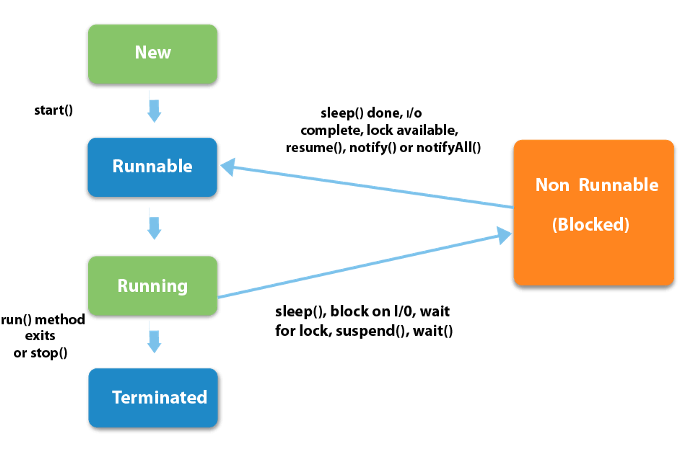
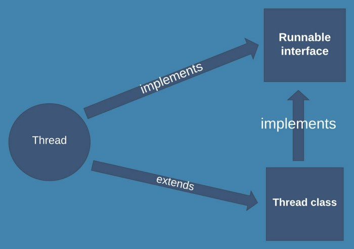

# Threads in Java

  
The word thread might familiar to you.This is not the thread that you might hear if you are not thinking like a programmer, If not, don’t worry. Let’s go with that topic from here. 
First lets talk about multi-tasking.
  
Multi-tasking means doing concurrently more than one tasks.There are two types of multi tasking.
 
1. Multi-threading  
2. Multi-processing
  

Just take a look at this picture. It’s about multi-tasking. It is showing that using the laptop while having meals. The two tasks are doing concurrently.

  

#### Now let’s talk about multi-processing and multi-threading

>Just imaging a situation we are making a document in a document making software ( Ms word, open office writer ) while listening to music. The Music player is also running in the background and the word processing software is the running foreground. That is a situation like multi-processing.
  

These two tasks are running simultaneously. But not at the same time exactly. Just jumping to both tasks frequently. Like 1 millisecond in writing documents and other 1 millisecond in listening to music. Like that way continuously happens. We need to consider that mechanism when talking about multi-threading.

>Now imaging a situation like we download a file from the internet while downloading it we can download another file also. That is a multi-threading example.

This time also it is same as multi-processing. Multi-threading is also happening like multi-processing.
let’s take another example that you all might have done so far.

>having meals while watching the TV.😉 Consider that situation. Watching TV while eating means we are neither all the time watching TV nor eating. We jump between those tasks simultaneously. It takes a few seconds to look at the plate of foods just look and then again look at the TV. In that situation, both watching TV and having meals are like threads(small processes or tasks) and it can be called multi-tasking according to our topic it can be considered as multi-threading also the theory is the same for both multi-threading and multi-tasking.

<b>You might be having doubts about what a thread is. Don’t worry let’s go through it like this.</b>

Thread is just like a small process. But it is lightweight which can share resources among them. We can divide a process into several threads and can be simplified the process. Threads have a single flow of control and every program is having a thread. And thread has a beginning, body, and the end. And it executes commands sequentially.  

So multithreading means executing more than one command in parallel. Java supports for the Multithreading, it is a key benefit for developers. There should be having a way to run more than one thread at the same time. Java compiler takes the part of which thread should run at which time, like that. There is an algorithm to do that. It’s a bit difficult to understand that algorithm which is how that threads are running simultaneously.  

Now you might have a question where else we can use threads. Here some examples where we can use threads.

    * The best example of the use of thread is Games. We use multiple objects in games they are threads.

    * Like our previous example, running the music app in the background and working in anything else application.

    * Performing some execution while I/O waiting.
  

Let’s take a look at the properties of threads. It has the main states. They are called the life cycle of a Thread

    * Newborn -When the thread is created, it is in this state.

    * Runnable -Thread is ready to execute waiting for the availability of the processor.

    * Running -This is the time when the thread is executed.

    * Blocked -This happens when the Thread is suspended, slept, or waited in order to satisfy certain requirements. This state prevents entering a thread from running state or runnable state.

    * Dead (Terminated )- After executing the run method. thread
  

  

Now you might have a question where else we can use threads. Here some examples where we can use threads.   

Now let’s see how to make a thread in java. There are two ways to make a thread in java.  

    * By extending the Thread class

    * By Implementing the Runnable interface
  
from these both ways we can make threads. We need to understand which way is the ideal way for that relevant time.
  
Consider that java can’t exist multiple inheritances. In that case, it would rather use runnable interface to make threads in java. It depends on the situation.
  

   

### 1) Extending the Thread Class

Just extend the thread class and override the run method inside it. The relevant codes can be placed inside that run method.

  

Until call the start method , the Thread is not running. It is in the newborn state. To go to running state need to call start() method. In the extended thread class it must be having a run method .
### 2) Implementing the runnable interface

The runnable interface declares the run() method required for implementing threads in the programs.

  

This is how to make a thread with runnable interface in java.
 <b>Now let’s see how to stop a thread.</b>
 

From stop() method, a thread can be stopped. When calling stop method, the thread goes to dead state from running state.   
  

### Let’s see what are the ways to block a thread

There are several ways to block a thread

    * sleep() — Thread gets started after a specified time interval unless it is interrupted.

    * suspend()— This method puts a thread in the suspended state and can be resumed using resume() method.

    * wait()— Causes the current thread to wait until another thread invokes the notify().

    * notify() — Wakes up a single thread that is waiting on this object’s monitor.

    * resume()— This resumes a thread, which was suspended using suspend() method.

    * stop()— stops a thread completely.

  
This is how we can use threads in java. While java is allowing multi-threading, some other programming languages are not allowing for multi-threading. So that we can imaging how useful java is. 😉😉.

Hope you got something from my article. Thanks for reading my article.
